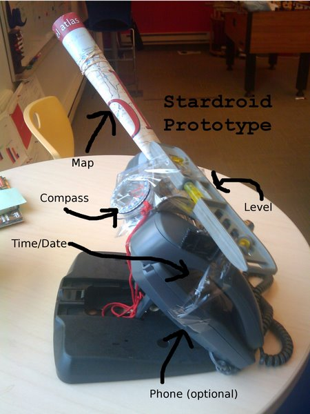

#  Sky Map
[](https://opensource.org/licenses/Apache-2.0)
[](https://travis-ci.org/sky-map-team/stardroid)
[](https://www.buymeacoffee.com/skymapdevs)

http://stardroid.app

Sky Map is the open-source astronomy Android app built for the community.  You can download the official builds from the [Google Play Store](https://play.google.com/store/apps/details?id=com.google.android.stardroid) or from [F-Droid](https://f-droid.org/en/packages/com.google.android.stardroid/).

## FAQ
### Is this *Google* Sky Map?
It was originally! 

Sky Map has a *long* history, launching as Google Sky Map on the very first Android phone at Searchology 2009. In 2011 Google ceased active support and the original developers open-sourced it with Google's permission.  Google's [Open Source Programs Office](https://opensource.org/blog/google-ospo-why-we-support-the-osi) kindly allowed us to continue to work on it as a personal project, provided we removed Google's branding from it and did not use Google's resources. Today it is still maintained by the same folks. While we no longer work for Google we continue to develop Sky Map using our own resources.

#### Then what is stardroid?
"Stardroid" was the internal name - you can see it's still used as an identifier in the code. Back in the day Google's lawyercats were concerned that 'stardroid' might attract the wrath of, let's say, followers of the Dark Side of the Force so we were _strongly_ encouraged not to call it that. Plus, Google likes to name products after what they are (Photos, Calendar, Docs...). So, Sky Map it is.

### Why does it lack feature _X_ or look so dated?
Android has evolved significantly since 2009. While most of the code has been rewritten since its Google days, the architecture reflects its origins. We are currently working on a complete modernization of the app. In the meantime, we are continually inspired by the community of users who still find joy in its simplicity and quirks.

### How can we help?
I'm glad you asked! We have a section on that below.

---
## Support the Project

<a href="https://www.buymeacoffee.com/skymapdevs" target="_blank"></a>

Sky Map is a labor of love maintained in our spare time by a couple of ex-Googlers here in Pittsburgh. It is free, open-source, ad-free and we don't track you or sell your data. 

If you enjoy using Sky Map, there are several ways to help keep the project alive:

* **Donations:** [Buy Me a Coffee](https://www.buymeacoffee.com/skymapdevs) — Every coffee helps keep the servers running and the code flowing!
* **Join the beta and give us feedback!** Visit the [Play Store](https://play.google.com/store/apps/details?id=com.google.android.stardroid) on your phone.
* **Star the Repo:** It costs nothing and helps others find the project.
* **Contribute:** Submit a Pull Request or [report an issue](https://github.com/sky-map-team/stardroid/issues/).

### Find us elsewhere
* [Facebook @stardroidapp](https://www.facebook.com/groups/stardroidapp/)
* [X @skymapdevs](http://x.com/skymapdevs)

---

# Code and Language Contributions
Yes, we know that Sky Map's code and UX is very dated. It needs a big overhaul.

In general, bug fix contributions are welcome, for example, simple one file fixes or dependency version upgrades.  We're particularly grateful for fixed or new translations since we've lost the 100% coverage of non-English languages that we once had.

**However, please [email us](mailto:skymapdevs@gmail.com) (or file a feature request) first before embarking on any major changes or feature additions. We may have a different vision for the direction of the app and it would be a pity to do work that we can't accept and would be wasted.**

### A Note on Response Times
It is likely we'll be slow to respond to emails and PR requests. Depending on what else is going on it might be days, it might be months. I do apologize for that - life is busy. Sometimes the reply might be simply to point you at this documentation, which will seem very ungrateful and unfriendly.

*Pro-tip:* Small, focused PRs to fix bugs or upgrade dependencies etc are very easy for us to approve. If your PR does too much it might get stalled because even if 90% of it is welcome there might be 10% that we're not happy with. So keep them small if you can. Plus, we'll be able to review them faster.

Thanks for your contributions! They're definitely appreciated even if our slowness to respond might make it seem otherwise.

---

## Technical Instructions
### Building the project

You should see the following
two directories:
 * app: Application source
 * tools: Source for generating binary data used by the app.

To build SkyMap, you can use Android Developer Studio or Gradle.  Begin by
creating a `local.properties` file containing the location of your
Android installation:

    sdk.dir=<path to your SDK>

Android Developer Studio can create this for you.  You can regenerate the data files and
rebuild everything with the `build_skymap.sh` script:

    ./build_skymap.sh

If you just want to quickly regenerate an apk without regenerating the data (danger!) 
pass the flag `--quick` or see the following instructions to do it by hand.  Pass the flag
`--fdroid` to build the FDroid variant.

### Building a debug apk
If you want to build without the script then: from the root directory execute

    ./gradlew :app:assembleGmsDebug

The apk can be found in `app/build/outputs/apk/`.

### Building a release apk or bundle
Note: Sky Map team only

Create a file in the app directory called
`no-checkin.properties` with appropriate values for the
keys

```
# These values are for the bundle to upload to the Play Store
upload.store-pwd=
upload.key-pwd=
upload.keystore.path=
upload.keystore.alias=
# These values are for a standalone apk
apk.store-pwd=
apk.key-pwd=
apk.keystore.path=
apk.keystore.alias=
analytics-key=
```

and overwrite google-services.json with the correct file.

Either use the build script, or from the root directory execute

    ./gradlew :app:assembleGms

or

    ./gradlew :app:assembleGmsRelease

The apk can be found in `app/build/outputs/apk/`.

> New!

Going forward Google Play Store will handle the apk signing so instead
we need to build and upload bundle files.  The command for this is

    ./gradlew :app:bundleGmsRelease

and the resulting file is in `app/build/outputs/bundle/`.

### Running tests
Unit tests:

    ./gradlew :app:test

Connected device/emulator required tests:

    ./gradlew :app:connectedAndroidTest

### Deploying to your phone or an emulator
Plug your phone in and run the `deploy.sh` script.  Pass the `-d` flag if you built the debug version.  `undeploy.sh` does the reverse.

### Deploying to the Google Play Store
Note: Sky Map Team Only

We use `fastlane` to manage updates to the Play Store.  If you have
it installed, available commands can be seen either by typing

```
bundle exec fastlane
```
or by perusing [fastlane/README.md](fastlane/README.md).

### Coding Style

We follow the [Google style guide](https://google.github.io/styleguide/javaguide.html) (or try to).  We wrap at 100 chars and we do not use the common Android style of prefixing member variables with a 'm'. 

# Fun
## Sky Map Prototype (2009)



## Star Chart
Appropriately, for a star chart app, here's a star chart:
[](https://app.repohistory.com/star-history)


