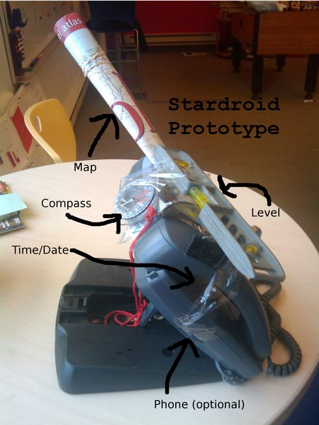

#  Sky Map

http://stardroid.app

Sky Map is the open-source astronomy Android app built for the community.

## Need Help?
> Check out [help.md](help.md) and [troubleshooting.md](troubleshooting.md) for accuracy issues and why 'compass calibration' doesn't do what you think it does.

## FAQ
### Is this *Google* Sky Map?
It was originally! 

Sky Map has a *long* history, launching as Google Sky Map on the very first Android phone at Searchology 2009. In 2011 Google ceased active support and the original developers open-sourced it with Google's permission.  Google's [Open Source Programs Office](https://opensource.org/blog/google-ospo-why-we-support-the-osi) kindly allowed us to continue to work on it as a personal project, provided we removed Google's branding from it and did not use Google's resources. Today it is still maintained by the same folks. While we no longer work for Google we continue to develop Sky Map using our own resources.

#### Then what is stardroid?
"Stardroid" was the internal name - you can see it's still used as an identifier in the code. Back in the day Google's lawyercats were concerned that 'stardroid' might attract the wrath of, let's say, followers of the Dark Side of the Force so we were _strongly_ encouraged not to call it that. Plus, Google likes to name products after what they are (Photos, Calendar, Docs...). So, Sky Map it is.

### Why does it lack feature _X_ or look so dated?
Android has evolved significantly since 2009. While most of the code has been rewritten since its Google days, the architecture reflects its origins. We are currently working on a complete modernization of the app. In the meantime, we are continually inspired by the community of users who still find joy in its simplicity and quirks.

### How can we help?
I'm glad you asked! We have a section on that below.

---
## Support the Project

Sky Map is a labor of love maintained in our spare time by a couple of ex-Googlers here in Pittsburgh. It is free, open-source, ad-free and we don't track you or sell your data. 

If you enjoy using Sky Map, there are several ways to help keep the project alive:

* **Donations:** [Buy Me a Coffee](https://www.buymeacoffee.com/skymapdevs?utm_source=github&utm_medium=readme&utm_campaign=readme_support) — Every coffee helps keep the servers running and the code flowing!
* **Join the beta and give us feedback!** Visit the [Play Store](https://play.google.com/store/apps/details?id=com.google.android.stardroid) on your phone.
* **Star the Repo:** It costs nothing and helps others find the project.
* **Contribute:** See the [Contributing guide](CONTRIBUTING.md) or [report an issue](https://github.com/sky-map-team/stardroid/issues/).

### Find us elsewhere
* [Facebook @stardroidapp](https://www.facebook.com/groups/stardroidapp/)
* [X @skymapdevs](http://x.com/skymapdevs)

---

# Contributing

Bug fixes, dependency upgrades, and translations are always welcome. For major changes or new features, **please [email us](mailto:skymapdevs@gmail.com) first** — we may have a different vision and it would be a shame for your work to go to waste.

See [CONTRIBUTING.md](CONTRIBUTING.md) for full details on build instructions, coding style, and how to submit a PR.

---

# Licensing & Trademarks

The source code of Sky Map is licensed under the [GNU General Public License v3.0](LICENSE.md). 

However, all branding, app names, logos, and UI asset files located in:
- [stardroid-v1/app/src/main/assets/branding](stardroid-v1/app/src/main/assets/branding)
- [stardroid-v1/assets](stardroid-v1/assets)
- **Any launcher icons, logos, brand names, or splash screen assets located under [stardroid-v1/app/src/main/res/](stardroid-v1/app/src/main/res/) (including mipmap and drawable subdirectories)**

are **All Rights Reserved** and the property of **Penterakt LLC**. You are not granted any rights or license to use these assets, app names, or logos in any derivative works or redistributions without express written consent.

*Note: This reservation of rights does not apply to third-party public-domain or open-licensed assets (such as NASA/ESA astronomical images or public-domain catalogs) included in the repository, which remain under their original terms.*

---

# Fun
## Sky Map Prototype (2009)

## Star Chart
Appropriately, for a star chart app, here's a star chart:

