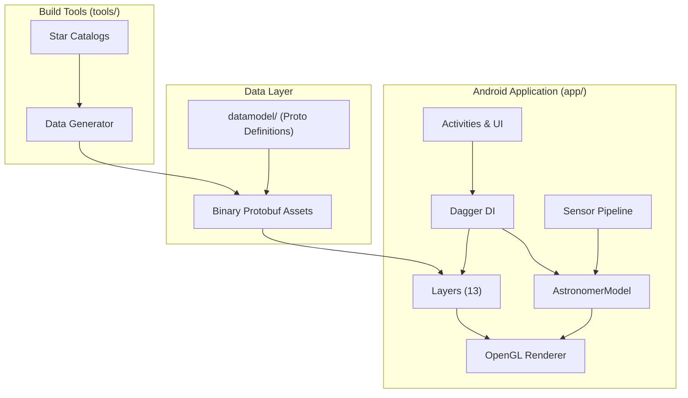

# Architecture Overview

Sky Map is an Android planetarium app that displays the night sky in real-time using device sensors and OpenGL rendering. The codebase is written in Java and Kotlin, targeting Android SDK 26–35.

## High-Level Architecture



## Module Structure

| Module | Purpose |
|--------|---------|
| **app/** | Main Android application — activities, rendering, sensor handling, layers |
| **datamodel/** | Protocol buffer definitions for astronomical objects (`source.proto`) |
| **tools/** | Standalone utilities for converting star catalogs to binary protobuf format |

## Build Flavors

- **gms** — Includes Google Play Services (Analytics, Location). Requires `no-checkin.properties` for release builds.
- **fdroid** — Pure open source, no Google dependencies.

## Dependency Injection (Dagger 2)

The app uses a two-level Dagger component hierarchy:

1. **ApplicationComponent** — Singleton, app-level dependencies (created in `StardroidApplication`)
2. **Activity Components** — Per-activity scoped components (e.g., `DynamicStarMapComponent`)

Each activity defines its own Dagger component that depends on `ApplicationComponent`. Activities annotated with `@PerActivity` scope receive activity-specific instances.

Key injection points:
- `StardroidApplication.onCreate()` — Initializes `DaggerApplicationComponent`
- Activity components — Inject activity-specific dependencies via `inject(activity)` method

## Rendering Pipeline

The rendering system transforms astronomical objects into OpenGL primitives:

```
Layer → AstronomicalSource → Primitives → OpenGL
```

### Layers

The `layers/` package contains 13 switchable layers (stars, constellations, planets, ISS, etc.):
- Data-driven layers extend `AbstractFileBasedLayer` (loads protobuf data)
- Simple layers like `HorizonLayer` contain their own `AbstractAstronomicalSource` subclass

### Sources

Astronomical objects implement the `AstronomicalSource` interface:
- `ProtobufAstronomicalSource` — Objects loaded from binary data files
- `PlanetSource` — Solar system objects with calculated positions

### Primitives

Four primitive types rendered by OpenGL:

| Primitive | Renderer | Examples |
|-----------|----------|----------|
| `PointPrimitive` | `PointObjectManager` | Stars, planets |
| `LinePrimitive` | `LineObjectManager` | Constellation lines, grids |
| `TextPrimitive` | `LabelObjectManager` | Labels |
| `ImagePrimitive` | `ImageObjectManager` | Images |

### Renderer

`RendererController` manages `RendererObjectManager` instances. Layers register with the controller, updates are queued as `RendererObjectManager.UpdateType`, and the actual OpenGL rendering happens in `SkyRenderer`.

## Coordinate Transformation

The core challenge is transforming device orientation into celestial coordinates:

```
Phone Coordinates → Transformation Matrix → Celestial Coordinates
```

Key class: `AstronomerModel` in the `control/` package.

The algorithm calculates North, Up, and East vectors in both coordinate systems:

1. **Phone coordinates** (`_p` suffix) — Two paths:
   - *Modern:* Uses Android's rotation sensor (fused accelerometer + magnetometer + gyroscope)
   - *Legacy:* Calculates from raw accelerometer and magnetometer readings

2. **Celestial coordinates** (`_c` suffix):
   - Up vector: Zenith based on user's latitude and local sidereal time
   - North vector: Projection of Earth's axis along the ground
   - East vector: Cross product of North × Up

3. **Transformation:** Matrix `M` constructed from these vectors transforms phone pointing direction to RA/Dec coordinates.

See [docs/design/sensors.md](design/sensors.md) for the detailed mathematical explanation and [docs/design/sensor_dataflow.md](design/sensor_dataflow.md) for the complete data flow.

## Data Pipeline

Astronomical catalog data flows through a generation pipeline:

```
Raw catalogs → tools/Main.java → ASCII protobuf → binary protobuf → app/src/main/assets/
                (StellarAsciiProtoWriter)  (AsciiToBinaryProtoWriter)
                (MessierAsciiProtoWriter)
```

At runtime, binary files are loaded by `AbstractFileBasedLayer` and deserialized into `ProtobufAstronomicalSource` objects.

See [docs/design/datageneration.md](design/datageneration.md) for the full pipeline design.

## Key Entry Points

| File | Role |
|------|------|
| [StardroidApplication.kt](../app/src/main/java/com/google/android/stardroid/StardroidApplication.kt) | Application entry point, Dagger initialization, sensor detection |
| [DynamicStarMapActivity.java](../app/src/main/java/com/google/android/stardroid/activities/DynamicStarMapActivity.java) | Main interactive star map |
| [AstronomerModel.java](../app/src/main/java/com/google/android/stardroid/control/AstronomerModel.java) | Coordinate transformation logic |
| [SkyRenderer.java](../app/src/main/java/com/google/android/stardroid/renderer/SkyRenderer.java) | OpenGL rendering |
| [source.proto](../datamodel/src/main/proto/source.proto) | Protocol buffer schema for astronomical objects |

## Further Reading

- [Design Documents Index](design/README.md) — Detailed design docs on sensors, rendering, ephemeris, and more
- [CLAUDE.md](../CLAUDE.md) — AI-oriented codebase guide with build commands and testing notes
