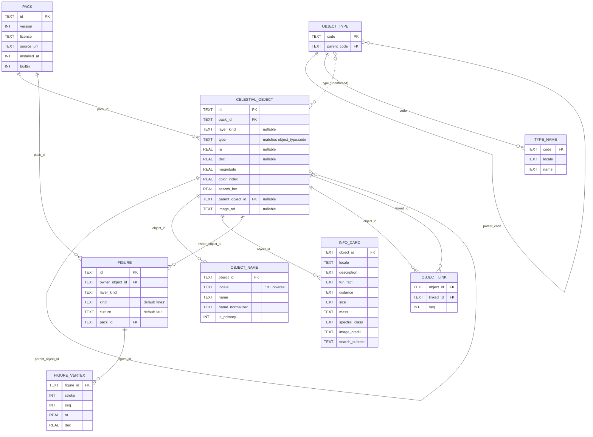

# Detailed Design: `:core:catalog` and the Room Schema

**Status: IMPLEMENTED** (domain, Room store, `source-data/` + DB generator — D32/D33/D34; the
render-API addendum and catalog-backed layers — D35). Builds on the
approved [data-layer.md](data-layer.md); supersedes its illustrative schema sketch.

Source baseline: v1 `source.proto`, binary assets, `renderables/proto/`, `search/`,
`education/` (object_info.json v2 format), and the three file-based layers.

## Findings from v1 that drive this design

| v1 fact | v2 consequence |
|---|---|
| `stars.binary` is 117 KB — a few thousand stars, not the "~100k" old specs claim | The whole bundled catalog (~250 KB incl. object_info) is small; bundling all locales initially (approved) is comfortably cheap. |
| Names are `strings.xml` resource references baked into protos at generation time | Replaced by `object_name` rows. v1's existing ~40-locale name translations are harvested **once** from v1's `strings.xml` files into the v2 source data — no re-translation. |
| Points carry pre-baked color/size/shape; labels carry pre-baked color/font-size/offset | The DB stores semantic data only (type, magnitude, color index). Styling is layer/backend policy (D12). |
| DSOs render as small type icons (galaxy, open/globular cluster, nebulae, SNR) via a `Shape`→drawable map | Render API addendum: `PointAppearance.Icon(image: ImageRef, sizeDp: Double)` — a screen-space icon point (unlike `ImagePrimitive`, it does not scale with zoom). |
| Constellation lines are raw coordinate polylines (not star references); constellations are themselves searchable named objects | Constellations are `celestial_object` rows that own `figure` polylines. |
| `object_info.json` v2: per-object description/fun-fact/distance/size/mass keys, spectral class, magnitude, image + credit, and virtual objects via `parentObjectId`/`searchSubtext` | Folds into `celestial_object` + `info_card`; `parent_object_id` column carries the virtual-object concept. |
| Search: in-memory trie (`PrefixStore`) over localized names, rebuilt at startup; system-search integration; coordinate parsing | Replaced by an indexed prefix query on a normalized name column — no startup index build, downloaded objects searchable automatically. |

## `:core:catalog` (pure Kotlin)

Domain model and repository interfaces; no Room, no Android.

```kotlin
data class CelestialObjectId(val value: String)     // stable key: "star/sirius", "dso/m31",
                                                    // "planet/jupiter", "constellation/orion"

/** Hierarchical type code, e.g. "galaxy.spiral.barred". Types are DATA (see object_type
 *  table), not an enum: downloaded packs may introduce subtypes the shipped app has never
 *  seen. Code anchors only on root codes; behavior (icons, grouping) resolves by walking
 *  UP the hierarchy, so unknown subtypes inherit their nearest known ancestor's treatment. */
value class TypeCode(val path: String) {
    fun isA(ancestor: TypeCode): Boolean   // "galaxy.spiral".isA(TypeCode("galaxy")) == true
}

enum class LayerKind { STARS, DEEP_SKY, CONSTELLATIONS /* future kinds are data, not code */ }

data class CatalogObject(
    val id: CelestialObjectId,
    val layerKind: LayerKind,
    val type: TypeCode,
    val position: RaDec,                  // J2000
    val magnitude: Double?,
    val colorIndex: Double?,              // B–V where known (stars)
    val name: String,                     // resolved for the request locale
    val searchFovDeg: Double?,            // target FOV when searched (v1 search_level)
)

data class Figure(val owner: CelestialObjectId, val strokes: List<List<RaDec>>)

interface CatalogRepository {
    /** Render-ready snapshot per layer; re-emits on locale or catalog change. */
    fun layerObjects(kind: LayerKind, locale: LocaleSpec): Flow<List<CatalogObject>>
    fun figures(kind: LayerKind, culture: String = "iau"): Flow<List<Figure>>
    suspend fun searchByPrefix(prefix: String, locale: LocaleSpec, limit: Int): List<SearchHit>
    suspend fun objectInfo(id: CelestialObjectId, locale: LocaleSpec): ObjectInfo?
}
```

- `LocaleSpec` encapsulates the fallback chain: exact tag → language → English → universal
  (`locale = ''`, used for designations like "M31", "NGC 224", which match in every locale).
- `SearchHit` carries id, display name, subtext, position, and `searchFovDeg` — everything the
  search UI and arrow need. The coordinate parser (`"12h 30m, +45°"`) stays a pure function in
  this module, layered over the same search entry point by the ViewModel.
- One generic catalog-backed `SkyLayer` (from the high-level design) consumes
  `layerObjects`/`figures` — stars, DSOs, and constellations differ only in `LayerKind` and
  how they map objects to primitives (stellar points vs. icon points vs. lines).

## Room schema (`:data`)

```sql
pack(id TEXT PK, version INT, license TEXT, source_url TEXT, installed_at INT,
     builtin INT)                          -- provenance; the shipped catalog is pack 'core'

object_type(code TEXT PK, parent_code TEXT NULL REFERENCES object_type)
type_name(code REFERENCES object_type, locale TEXT, name TEXT)   -- localized type display
                                          -- names ("Spiral galaxy"), same fallback chain
                                          -- as object names; packs may add subtypes

celestial_object(
  id TEXT PK, pack_id REFERENCES pack,
  layer_kind TEXT NULL,                    -- NULL = not rendered by any layer
  type TEXT,
  ra REAL NULL, dec REAL NULL,             -- J2000 degrees; NULL = no own position
  magnitude REAL, color_index REAL,
  search_fov REAL,
  parent_object_id TEXT NULL,              -- moons/components/features → search fallback
  image_ref TEXT NULL                      -- info-card photo key
)                                          -- INDEX (layer_kind), (parent_object_id)

object_link(                               -- non-hierarchical "see also" relations
  object_id REFERENCES celestial_object,
  linked_id REFERENCES celestial_object,
  seq INT                                  -- display order of chips on the info card
)                                          -- PK (object_id, linked_id)

object_name(
  object_id REFERENCES celestial_object, locale TEXT,   -- '' = universal designation
  name TEXT, name_normalized TEXT,         -- lowercased, diacritic-stripped at generation
  is_primary INT
)                                          -- INDEX (name_normalized), (object_id, locale)

info_card(
  object_id REFERENCES celestial_object, locale TEXT,
  description TEXT, fun_fact TEXT,
  distance TEXT, size TEXT, mass TEXT,     -- localized display strings, as in v1
  spectral_class TEXT, image_credit TEXT, search_subtext TEXT
)                                          -- PK (object_id, locale)

figure(id TEXT PK, owner_object_id REFERENCES celestial_object,
       layer_kind TEXT, kind TEXT DEFAULT 'lines',   -- future: 'boundary' etc.
       culture TEXT DEFAULT 'iau', pack_id REFERENCES pack)
figure_vertex(figure_id REFERENCES figure, stroke INT, seq INT, ra REAL, dec REAL)
```

### Entity-relationship diagram

`celestial_object` is the hub: every other table hangs off it directly, except
`type_name` (hangs off `object_type`) and `figure_vertex` (hangs off `figure`).
`object_type.parent_code` and `celestial_object.parent_object_id` are both
self-referencing, unrelated hierarchies (type taxonomy vs. virtual-object parent).
`celestial_object.type` is a plain TEXT match against `object_type.code`, not an
enforced FK (packs may ship subtypes the schema has never seen — see the findings
table above).



### Searchable / has-info / renderable are independent capabilities

v1's "virtual objects" (planetary moons searchable via their parent) are one case of a
general principle this schema encodes: every catalog entry is searchable and may carry an
info card, while **position and renderability are optional, independent capabilities**:

| Capability | Mechanism | Examples |
|---|---|---|
| Rendered | `layer_kind` non-NULL | stars, DSOs, constellations |
| Own position, not rendered | `ra/dec` set, `layer_kind` NULL | Sgr A*, Cygnus X-1, celestial poles, out-of-apparition comets |
| Parent position | `ra/dec` NULL, `parent_object_id` set | planetary moons (until their ephemerides land), exoplanets, multiple-star components, surface features (Tycho, Great Red Spot) |
| Ephemeris position | `ra/dec` NULL; id maps to a `SolarSystemBody` | Sun, Moon, planets — rendered by `SolarSystemLayer`, positioned at query time (below) |
| Info only | all NULL | rare; allowed (concept entries) |

**Search target resolution:** own position → parent's position → none (card only). When the
Galilean moons gain computed positions later, they get `ra/dec` (via ephemeris) and a
`layer_kind` — identity, names, info cards, and links are untouched.

**Ephemeris-positioned bodies:** solar-system objects are ordinary catalog rows — identity,
names, info cards, and "see also" links ship in packs like everything else — but no position
is ever *stored* for them: the DB generator leaves `ra/dec` NULL, and `layer_kind` stays NULL
because rendering belongs to `SolarSystemLayer`, not `CatalogLayer`. The stable id is the join
key between the two worlds (`"planet/jupiter"` ↔ `SolarSystemBody.JUPITER`, the same key the
render-api image mapping uses). `CatalogRepository` stays ephemeris-free: it reports such hits
with a `null` position, and the federated search feature (`SearchViewModel`) resolves them
through `Ephemeris` at query time — via the hit's own id if it maps to a body, else its
parent's id (Io stores no coordinates and neither does Jupiter, yet the locator line still
reads "shown at Jupiter's position"). Time-varying card facts (current distance, phase) are
likewise computed from `Ephemeris` by the card feature; `info_card` columns stay static
display strings.

**Info-card UX for non-rendered objects:** the card opens for the object actually searched
(Io, not Jupiter), with a locator line under the title ("Orbits Jupiter — shown at Jupiter's
position"; "Not visible to the eye — radio source"), a parent breadcrumb ("Jupiter › Io")
navigating to the parent's card, and the end-of-search crosshair marking the resolved sky
position — for invisible objects the crosshair plus card *is* the experience.

**"See also"** (`object_link`) is deliberately not parent-child: Jupiter links to its moons
and the Great Red Spot, Sirius to Sirius B, Halley's Comet to the Orionids. Rendered on the
info card as a scrollable chip row (in `seq` order); tapping a chip opens that card and
re-aims the search arrow if the target moved. Links ship in packs like everything else.

Notes:

- **Search is word-prefix matching via SQLite FTS** (Room `@Fts4`/`@Fts5` over `object_name`,
  unicode tokenizer with diacritic removal): the query "gal" matches "Andromeda **Gal**axy",
  and multi-word queries ("andr gal" → `andr* gal*`) work for free. This is what users
  actually want from mid-name terms — arbitrary-substring `%term%` matching adds little
  beyond it and can't use an index. Ranking: whole-name-prefix matches first, then word-
  prefix, weighted by `is_primary` and magnitude, filtered by the locale chain. No in-memory
  trie, no startup index build, and downloaded packs are searchable the moment their rows
  land. (True-substring fallback, if ever demanded, is an affordable scan at this scale when
  FTS results come up short — deferred until evidence demands it.)
- **Alternative constellation cultures** (planned feature) are `figure.culture` values plus
  their own `object_name` rows — data, not schema change.
- **Figure kinds** (out of scope, designed for): `figure.kind` distinguishes stick figures
  (`'lines'`) from future constellation *boundaries* (`'boundary'`). An object may have
  several figures rendered simultaneously — naturally as separate toggleable layers (a
  boundaries layer queries `kind='boundary'`), which the per-layer scene model already
  supports with no new machinery. Cultures apply to stick figures; IAU boundaries are
  culture-independent.
- **The catalog DB is read-mostly and replaceable.** User state (preferences, future
  favorites) lives in DataStore, never in this DB, so app updates can swap the bundled pack
  wholesale: on first run after update, re-copy `createFromAsset` content for `builtin` packs
  while preserving downloaded packs (keyed by `pack_id`). No Room migrations needed for
  catalog *content*; schema migrations follow normal Room versioning.
- **Local failure modes (G11/D24).** Because the DB is a replaceable derived artifact, recovery
  is cheap: `createFromAsset`/DB-open failure → delete and re-copy from the bundled asset; if
  that also fails, surface an error state but keep the app launchable (settings/help). Pack
  application is transactional per `pack_id`, so a failed or partial download leaves prior
  catalog state intact (extends the graceful-degradation principle in
  [data-layer.md](data-layer.md)). A texture/image decode failure skips that image and renders
  the rest of the scene.

## Build-time generation (replaces v1 `tools/`)

A Gradle task (JVM, plain JDBC-SQLite) in the v2 repo:

```
source-data/                      (human-readable, checked in — the F-Droid requirement)
  stars.csv                       from v1 tools' raw catalog, one-off conversion
  dso.csv
  constellations/iau.json         figures per culture
  objects.json                    position-less objects (ephemeris bodies, moons, showers)
                                  + metadata overlays (images, "see also", parents)
  types.json                      the hierarchical type vocabulary
  names/{locale}.csv              harvested once from v1 strings.xml (~30 locales);
                                  universal.csv = the '' locale (designations)
  info_cards/{locale}.json        from object_info.json + its string resources
        │
        ▼  :data:generateCatalogDb (deterministic output: fixed page size, no timestamps,
        │   stable row order — reproducible builds keep F-Droid happy; D34)
        ▼
skymap.db packaged as a :data variant asset (not checked in; built artifact)
```

The same task + sources later produce downloadable pack files (same schema, different
`pack_id`), so the download feature ships data the app already knows how to read.

## Render API addendum

`PointAppearance` gains a third kind (deep-sky markers, meteor-shower radiants):

```kotlin
data class Icon(val image: ImageRef, val sizeDp: Double) : PointAppearance
```

Screen-space like `Fixed` (does not scale with zoom), drawn from the icon atlas the GLES1
backend already keeps for v1's DSO shape drawables.

## Testing

- Repository tests against an in-memory Room DB with a miniature generated fixture pack
  (exercises locale fallback, prefix search ranking, pack replacement logic).
- Generator golden test: run the task on fixture sources, assert deterministic byte-identical
  output (the reproducibility guarantee, enforced in CI).
- Parity check: a one-off script diffs v1 binary content against the generated DB (object
  counts, positions, names per locale) before v1 data sources are retired.
