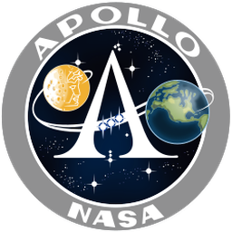
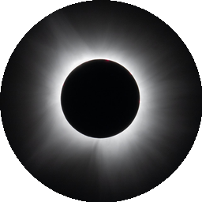
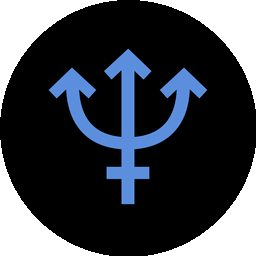
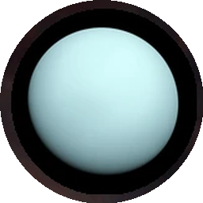
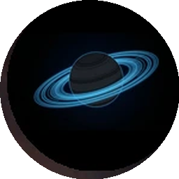
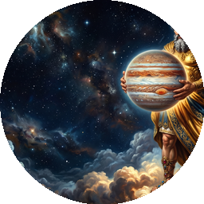
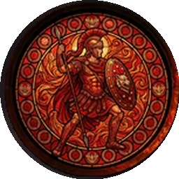

# Release names

Proposed codenames for future v2 releases, grouped by starting letter. Names are drawn from
real space missions/spacecraft. Used only as a candidate pool — the `skymap.release` skill still
confirms the actual name with the maintainer at release time (see that skill's Step 1).

Names already used: Hannah, Louise, Apollo (current, since 2.0.0 stable) — see `CHANGELOG.md`
for the authoritative history.

- **A** — Apollo / Artemis
- **B** — Beresheet / Buran
- **C** — Cassini / Curiosity
- **D** — Dawn / Discovery
- **E** — Explorer / Euclid
- **G** — Galileo / Gemini / Griffin
- **H** — Hayabusa / Hubble
- **J** — Juno / James Webb
- **K** — Kepler
- **M** — Mariner / Messenger / Magellan
- **N** — New Horizons
- **O** — Orion / OSIRIS-REx
- **P** — Pioneer / Perseverance / Peregrine
- **R** — Rosetta / Ranger
- **S** — Sputnik / Skylab
- **T** — TESS / Titan
- **V** — Vostok / Voyager / Viking / Venera

## Used names

Names already assigned to a release, most recently used first. A name covers every point release
that shipped under it (`## [2.0.x:Name]` headings in `../../CHANGELOG.md`); "First released"
is the date of that name's earliest release, not its most recent one.

### v2

| Icon | Name | First released | Mission |
|---|---|---|---|
|  | **Apollo** | 2026-07-23 (2.0.0-alpha02) | [Apollo program](https://en.wikipedia.org/wiki/Apollo_program) — NASA's 1961–1972 program that landed the first crewed missions on the Moon. |
|  | **Louise** | 2026-08-29 (2.0.0-beta05) | Not a space mission — a placeholder/personal name used for this beta round before the mission-name convention (this doc's list above) was adopted. Origin not recorded; flagging rather than guessing. |
| — | **Hannah** | 2026-08-16 (2.0.0-beta01) | Not a space mission — same placeholder situation as Louise, no icon was produced for this beta round. Origin not recorded. |

### v1

v1 predates the mission-name convention entirely — its names are mostly solar-system bodies
(in outward order from the Sun) plus a couple of comets, not missions.

| Icon | Name | First released | Subject |
|---|---|---|---|
|  | **Eclipse** | 2026-08-09 (1.18.0) | [Eclipse](https://en.wikipedia.org/wiki/Eclipse) — when one astronomical object is temporarily obscured by another passing between it and the observer or its light source. |
|  | **Neptune** | 2026-07-28 (1.17.0) | [Neptune](https://en.wikipedia.org/wiki/Neptune) — the eighth and outermost known planet of the Solar System. |
|  | **Caelus** | 2026-06-19 (1.16.0) | [Caelus](https://en.wikipedia.org/wiki/Caelus) — the primordial Roman god of the sky, the Roman-mythology counterpart to Uranus. |
|  | **Saturn** | 2026-05-22 (1.15.0) | [Saturn](https://en.wikipedia.org/wiki/Saturn) — the sixth planet from the Sun, known for its prominent ring system. |
|  | **Jupiter** | 2026-05-05 (1.14.2) | [Jupiter](https://en.wikipedia.org/wiki/Jupiter) — the fifth planet from the Sun and the largest in the Solar System. |
|  | **Mars** | 2026-04-12 (1.13.3) | [Mars](https://en.wikipedia.org/wiki/Mars) — the fourth planet from the Sun, known as the "Red Planet." |
|  | **Earth** | 2026-03-01 (1.12.0) | [Earth](https://en.wikipedia.org/wiki/Earth) — the third planet from the Sun and the only known astronomical object to harbor life. |
|  | **Venus** | 2026-02-03 (1.10.11) | [Venus](https://en.wikipedia.org/wiki/Venus) — the second planet from the Sun, similar in size to Earth but with a runaway-greenhouse atmosphere. |
| — | **Mercury** | 2026-01-20 (1.10.10) | [Mercury](https://en.wikipedia.org/wiki/Mercury_(planet)) — the smallest planet in the Solar System and the closest to the Sun. |
| — | **Comet Leonard** | 2021-12-21 (1.10.0) | [C/2021 A1 (Leonard)](https://en.wikipedia.org/wiki/C/2021_A1_(Leonard)) — a long-period comet discovered in January 2021, the brightest comet of that year. |
| — | **Neowise** | 2020-07-17 (1.9.4) | [C/2020 F3 (NEOWISE)](https://en.wikipedia.org/wiki/C/2020_F3_(NEOWISE)) — a long-period comet discovered in March 2020 that became easily visible to the naked eye. |

Several early v1 releases (1.9.5–1.9.7, 1.10.4, 1.10.9) shipped without a release name at all —
omitted from this table.
